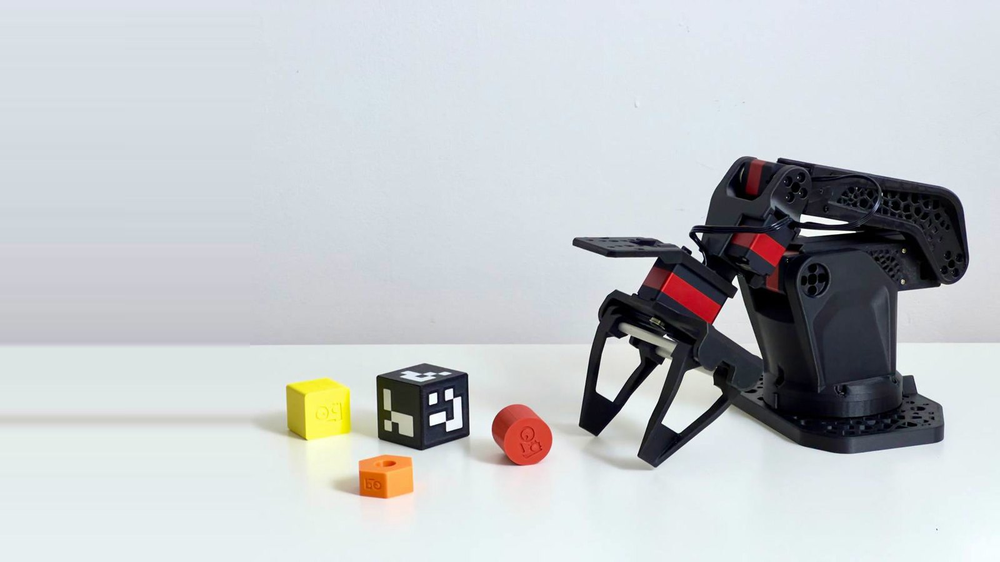
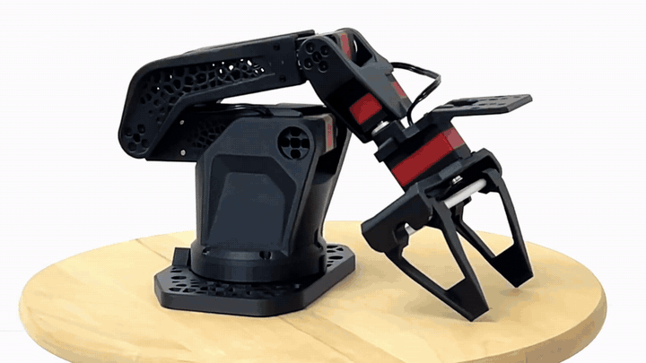
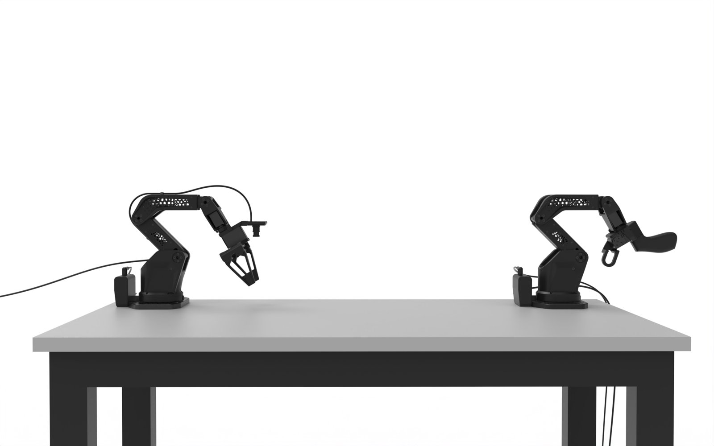
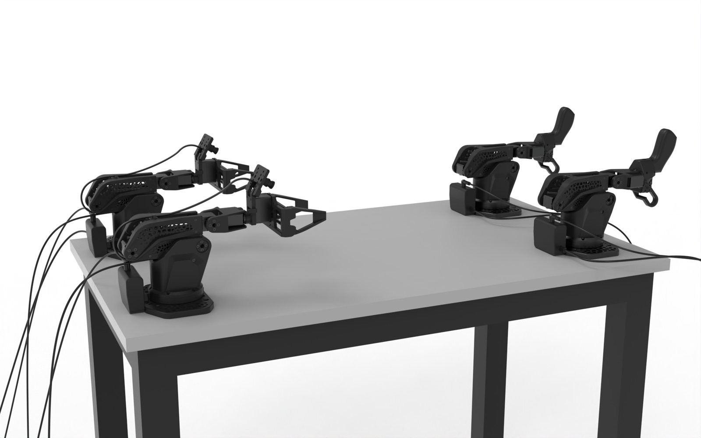
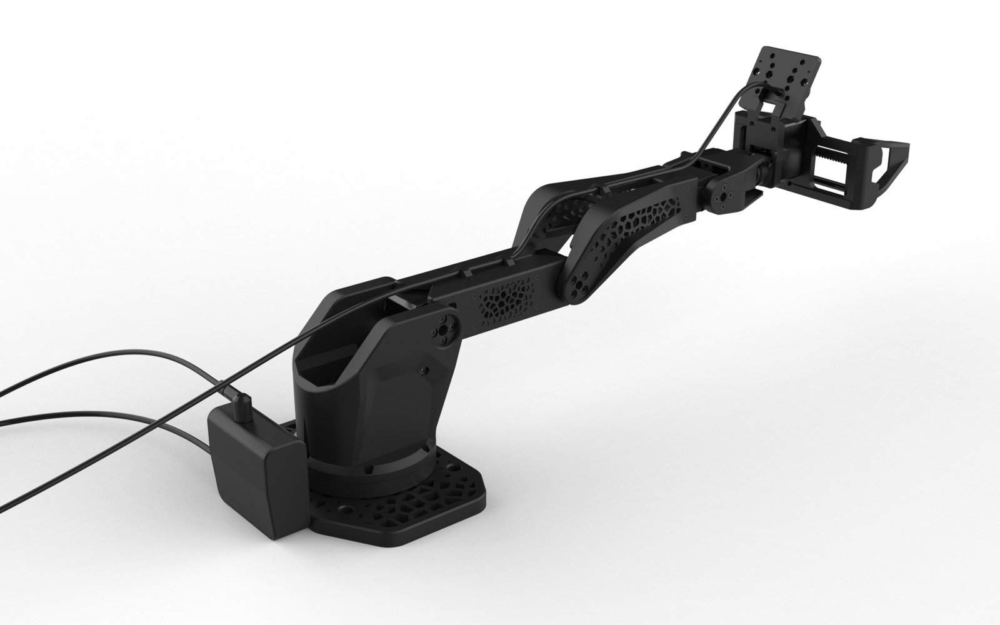
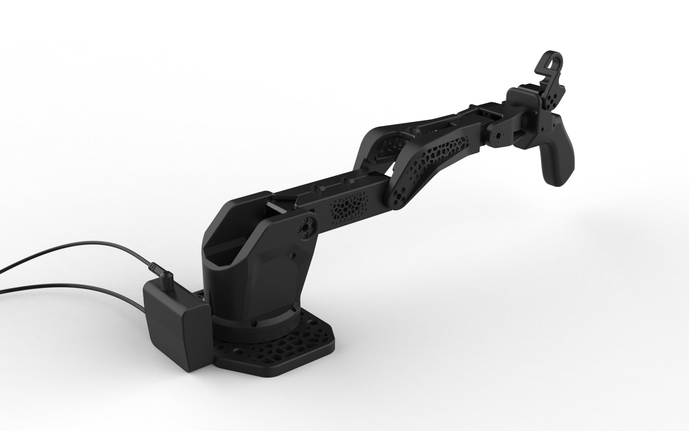

# SO-ARM 102

<div align="center">

[](assets/video/so-arm-102-preview.mp4)

**🎥 [Watch the preview video](assets/video/so-arm-102-preview.mp4)**

**An open-source 6-DOF leader + follower robot arm kit for teleoperation and imitation learning,
designed by [Robonine](https://robonine.com) as a stiffer, faster successor to the SO-ARM 101.**

[](HARDWARE-LICENSE.txt)
[](SOFTWARE-LICENSE.txt)
[](DOCS-LICENSE.txt)
[](#-known-issues)

📩 [hello@robonine.com](mailto:hello@robonine.com)

</div>

---

## ✨ What changed against SO-ARM 101

| | SO-ARM 101 | SO-ARM 102 |
|---|---|---|
| Gripper | Angular jaw | Parallel gripper, 85 mm span |
| Frame material | PLA | PET-CF (Fiberon PET-CF17 tested) |
| Structure | Solid links | Topology-optimised links |
| Base rotation range | 220° | **352°** |
| Horizontal reach | 441 mm | **483 mm** |
| Deflection at the gripper, 300 g load ¹ | 7.5 mm | **3.4–3.9 mm** |
| Shoulder and elbow speed | 45 RPM (STS3215) | **75 RPM (STS3250)** |
| Noise at 1 m | 70 dB | **60 dB** |

¹ Both arms built with printed servo dummies, so the frame is compared, not the motors.
Full results and test conditions are in [docs/specifications.md](docs/specifications.md).

The arm keeps the SO-ARM 101 joint layout, so it works with
[Hugging Face LeRobot](https://github.com/huggingface/lerobot) datasets and policies.

---

## 🎥 Preview

<div align="center">

[](assets/video/so-arm-102-preview.mp4)

*Click for the full video, 21 s*

</div>

---

## 🤝 Configurations

### Single-arm: one leader + one follower

The standard kit. Move the leader by hand, and the follower repeats the motion.
Use it for teleoperation and for recording demonstrations for imitation learning.



### Bimanual: two leaders + two followers

Two kits side by side. Each hand drives its own leader, so the followers can pass objects,
hold and work on a part, or do any task that needs two hands.



### The two arms

| Follower | Leader |
|:-:|:-:|
|  |  |
| Parallel gripper, wrist camera, 12 V | Handle with trigger, 5 V |

---

## 🚀 Build it in four steps

### 1. Print the parts

All parts fit a 180 × 180 mm bed. The largest part is 160 mm long.

- STL files, ready to slice: [`models/stl/`](models/stl/)
- STEP sources: [`models/step/`](models/step/)
- Material, settings and part quantities: [docs/printing.md](docs/printing.md)

The slicer estimates about 500 g of filament and 21 h of printing for the arm parts at the default settings.

### 2. Buy the hardware

Servos, bearings, electronics and fasteners: [docs/bom.md](docs/bom.md).

| Arm | Servos | Controller | Power |
|---|---|---|---|
| Follower | 2 × STS3235, 2 × STS3250, 2 × STS3215 | Waveshare Bus Servo Driver HAT | **12 V** |
| Leader | 6 × STS3215 | Waveshare Bus Servo Adapter | **5 V** |

> ⚠️ **The leader runs on 5 V and the follower on 12 V.** Do not swap the power supplies.

### 3. Assemble

- Printable booklet, 36 pages A5: [docs/SO-ARM102_assembly_A5_v0.6.pdf](docs/SO-ARM102_assembly_A5_v0.6.pdf)
- Step list with parts and fasteners: [docs/assembly-guide.md](docs/assembly-guide.md)

Tools: hex keys 1.5 mm (M2 screws) and 2 mm (M3 screws).

### 4. Set up the software

Servo IDs, calibration and lessons: **[lab.robonine.com](https://lab.robonine.com)**.
The arm uses the LeRobot SO-101 leader/follower workflow.

---

## 📁 Repository structure

```
├── models/
│   ├── stl/                 # Print-ready meshes
│   │   ├── common/          #   parts used by both arms
│   │   ├── follower/        #   parallel gripper, camera mount, board case
│   │   └── leader/          #   handle, trigger, wrist roll, board case
│   └── step/                # CAD sources, same layout as stl/
├── docs/
│   ├── printing.md          # Material, slicer settings, quantities
│   ├── bom.md               # Bill of materials
│   ├── assembly-guide.md    # Step list with parts and fasteners
│   ├── specifications.md    # Geometry, servos, measured results vs SO-ARM 101
│   └── SO-ARM102_assembly_A5_v0.6.pdf
├── assets/
│   ├── images/              # Photos, renders, booklet pages, test photos
│   └── video/               # Preview video and GIF
├── LICENSING.md             # Which licence covers which file
└── NOTICE                   # Third-party attribution
```

---

## ⚠️ Known issues

This is the first public release. An independent test build found the following.
They are being fixed and will land in the next release.

1. **Two models are reported missing from the release set.** One is known: the camera holder ships as STL only, without a STEP source.
2. **No slicer project files yet.** Supports and part orientation have to be set by hand. 3MF files are planned.
3. **M2 screws are hard to reach in several places.** Expect to fight a few of them.
4. **The gripper clamps run tight on carbon rods.** The clamp bores are sized for 6.1 mm. Rod diameters vary between suppliers, so check the fit before assembly.
5. **Check the servo cable lengths** before closing each joint, especially from the base to the shoulder.
6. **The assembly order is awkward in two places** of the booklet. Read two steps ahead before fastening.
7. **Leader joints can feel loose.** Adding 8 × 2 mm rubber O-rings between each servo and its horn gives the leader smooth, silent friction. Use two per servo on joints 1–4 and one on joints 5–6.

Found something else? Please [open an issue](https://github.com/roboninecom/SO-ARM-102/issues).

---

## 🔗 Related projects

- [SO-ARM100/101 Parallel Gripper](https://github.com/roboninecom/SO-ARM100-101-Parallel-Gripper), the gripper the SO-ARM 102 gripper grew from
- [SO-ARM101](https://github.com/TheRobotStudio/SO-ARM100) by TheRobotStudio, the arm this design succeeds
- [Practical comparison of smart serial servos](https://robonine.com/smart-serial-servo-motor-comparison-robotics/), the tests behind the servo choice
- [Choosing a filament for robotic arms](https://robonine.com/choosing-filament-for-robotic-arm-applications/), the tests behind PET-CF

---

## 📄 License

Copyright (c) 2026 Robonine. Different kinds of material carry different licences:

| Material | Licence |
|---|---|
| Hardware designs in `models/` | [CERN-OHL-P-2.0](HARDWARE-LICENSE.txt) |
| Software and configuration | [Apache-2.0](SOFTWARE-LICENSE.txt) |
| Documentation and images in `docs/`, `assets/`, all `README.md` | [CC BY 4.0](DOCS-LICENSE.txt) |

See [LICENSING.md](LICENSING.md) and [REUSE.toml](REUSE.toml) for the file-by-file map.

---

## 👥 Team

| Name | Role | Contact |
|------|------|---------|
| **Alan Subin** | Design Engineer: mechanical design, CAD, assembly booklet | [LinkedIn](https://www.linkedin.com/in/alan-subin/) |
| **Boris Kotov** | Software and Test Engineer: prototypes, printing, test rigs | [Telegram](https://t.me/bkotov) |
| **Nikita Bragin** | Project Manager | [Telegram](https://t.me/branikita) · [GitHub](https://github.com/brnikita) |
| **Mikhail Chistiakov** | Industrial Designer: look and form of the arm | [Telegram](https://t.me/brrryska) |
| **Mikhail Zhmaylo** | Structural Engineer: stiffness models, design changes to cut deflection | [Telegram](https://t.me/mikhail_zhmaylo) |
| **Vladislav Eremenko** | Structural Engineer: strength and thermal analysis, topology optimisation | [Telegram](https://t.me/v1ad_eremenko) |
| **Vladimir Osipov** | Tester and Consultant: independent test build | [Telegram](https://t.me/punarinta) · [GitHub](https://github.com/punarinta) |

<div align="center">

**Built for the robotics community by [Robonine](https://robonine.com)** 🤖

</div>
