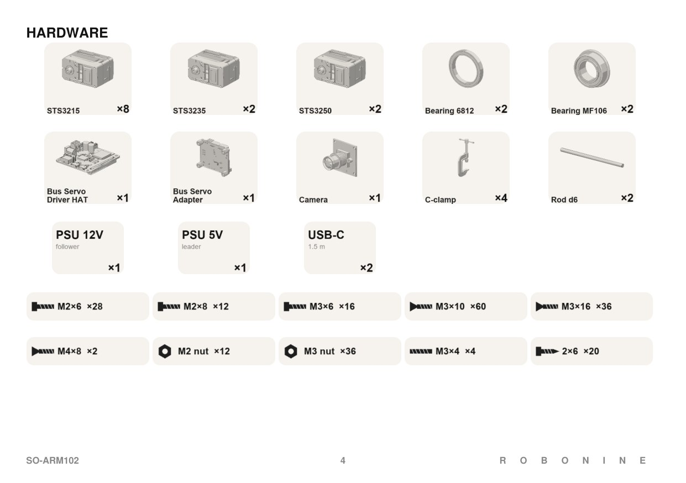

# Bill of materials

Quantities are for one complete kit: one follower arm and one leader arm.
Printed parts are listed separately in [printing.md](printing.md).

## Servos

| Joint | ID | Follower | Leader |
|---|:-:|---|---|
| Base rotation | 1 | ST-3235-С001 | ST-3215-C044, 1:191 |
| Shoulder lift | 2 | ST-3250-С002 | ST-3215-C044, 1:191 |
| Elbow flex | 3 | ST-3250-С002 | ST-3215-C044, 1:191 |
| Wrist flex | 4 | ST-3235-С001 | ST-3215-C044, 1:191 |
| Wrist roll | 5 | ST-3215-C049, 1:191 | ST-3215-C044, 1:191 |
| Gripper / Trigger | 6 | ST-3215-C049, 1:191 | ST-3215-C044, 1:191 |

Totals: 6 × STS3215 7.4V, 2 × STS3215 12V, 2 × STS3235 12V, 2 × STS3250 12V. All are Feetech TTL serial bus servos.

| Servo | Qty | Purchase link | Selection | Unit price (USD) | Kit cost (USD) |
|---|---|---|---|---|---|
| STS3215 | 6 | [Alibaba](https://www.alibaba.com/product-detail/Top-Seller-Low-Cost-Feetech-STS3215_1600999461525.html) | 7.4V TTL version for leader servos. Select ST-3215-C044 (7.4V). | $13.89 | $83.34 |
| STS3215 | 2 | [Alibaba](https://www.alibaba.com/product-detail/6pcs-12V-30KG-1-345-STS3215_1601900233170.html) | 12V TTL version for follower joints 5 and 6. Select ST-3215-C049 (12V30KG). | $14.70 | $29.40 |
| STS3235 | 2 | [Alibaba](https://www.alibaba.com/product-detail/FEETECH-STS3235-12V-30KG-TTL-Dual_1601910640629.html) | 12V TTL version for follower joints 1 and 4. | $40.79 | $81.58 |
| STS3250 | 2 | [Alibaba](https://www.alibaba.com/product-detail/Feetech-STS3250-12V-50kg-Servo-High_1601711893549.html) | 12V TTL version for follower joints 2 and 3. | $44.65 | $89.30 |

- **Follower, 12V.** STS3250 is a 50 kg·cm brushless servo at 75 RPM. It drives the two joints that carry the most load.
  STS3235 is a 30 kg·cm servo with lower backlash than the STS3215.
- **Leader, 5V.** The leader servos are only read, never loaded. You can use a passive STS3215 (ST-3215-C066) without motor and gearbox **only** for leader arm.
- Servo horns and the M3 × 6 horn screws come with the servos.

## Electronics

| Item | Qty | Notes | Purchase link | Unit / pack price (USD) | Kit cost (USD) |
|---|---|---|---|---|---|
| Waveshare Bus Servo Driver HAT | 1 | Follower controller | [Waveshare HAT (A)](https://www.waveshare.com/product/robotics/bus-servo-driver-hat-a.htm) | $18.99 | $18.99 |
| Waveshare Bus Servo Adapter | 1 | Leader controller | [Waveshare Adapter (A)](https://www.waveshare.com/bus-servo-adapter-a.htm) | $4.99 | $4.99 |
| Power supply 12V DC | 1 | Follower. 60W / 5A or more recommended. The arm peaked at 3.3A under a 300g load. Match the HAT's connector (5.5x2.5mm). | [Amazon search](https://www.amazon.com/s?k=12V+5A+power+supply+5.5+2.5mm) | ~$20.00 | $20.00 |
| Power supply 5V DC | 1 | Leader. Match the Adapter's connector (5.5x2.1mm). | [Amazon search](https://www.amazon.com/s?k=5V+power+supply+5.5+2.1mm) | ~$10.00 | $10.00 |
| USB-C cable, 1.5 m | 2 | One per controller. Choose a data cable, not a charging-only cable. | [Amazon search](https://www.amazon.com/s?k=USB+A+to+USB+C+data+cable+1.5m) | ~$7.00 / 2 | $14.00 |
| USB camera, 1080p | 1 | Wrist camera on the follower gripper. The prototype used an OV2735 module. Check module dimensions and mounting holes against the camera holder. | [Waveshare OV2735](https://www.waveshare.com/ov2735-2mp-usb-camera-a.htm) | $14.99 | $14.99 |
| Servo cables | 12 | Come with the servos. Pay attention during assembly where to put 4 long cables from STS3250 packing. | Included with the [servos](#servos); [Amazon search for spares](https://www.amazon.com/s?k=Feetech+STS3215+TTL+servo+cable) | Included | $0.00 |

## Mechanical parts

| Item | Size | Qty | Where | Purchase link | Unit / pack price (USD) | Kit cost (USD) |
|---|---|---|---|---|---|---|
| Ball bearing 6812 | 60 × 78 × 10 mm | 2 | Base rotation, one per arm | [Amazon search](https://www.amazon.com/s?k=6812+bearing+60+78+10mm) | ~$7.00 | $14.00 |
| Flanged bearing MF106ZZ | 6 × 10 × 3 mm | 2 | Gripper main frame | [Amazon](https://www.amazon.com/uxcell-MF106ZZ-6x10x3mm-Shielded-Bearings/dp/B08H289LLQ) | $9.99 / 10 | $2.00 |
| Rod | Ø6 × 125 mm, carbon or steel | 2 | Gripper guides | [Amazon steel rods](https://www.amazon.com/SKYPRO-Stainless-Diameter-Industry-Working/dp/B0CLCSWSJ9) · [Amazon carbon tubes](https://www.amazon.com/MECCANIXITY-Carbon-Pultruded-Airplane-Quadcopter/dp/B0CZDCW2NL) (cut to 125 mm) | $11.89 / 5 steel rods | $4.76 |
| C-clamp | 3 inch, 0–75 mm opening | 4 | Two per arm, to fix the base to the table | [Amazon search](https://www.amazon.com/s?k=3+inch+C+clamp+75mm) | ~$5.00 | $20.00 |
| Rubber O-ring, optional | 8 × 2 mm | 12 | Adds friction to the leader joints. Two per servo on joints 1–4, one on joints 5–6. | [Amazon search](https://www.amazon.com/s?k=rubber+O+ring+8mm+inner+diameter+2mm+cross+section) | ~$6.00 / 100 | $0.72 (optional) |

## Fasteners

Kit totals as packed in the assembly booklet.

| Fastener | Standard | Qty | Purchase link | Unit / pack price (USD) | Kit cost (USD) |
|---|---|---|---|---|---|
| M2 × 6 socket head | DIN 912 | 28 | [Amazon search](https://www.amazon.com/s?k=DIN+912+M2x6+socket+head+screw) | ~$6.99 / 100 | $1.96 |
| M2 × 8 socket head | DIN 912 | 12 | [Amazon](https://www.amazon.com/TOP-VIGOR-Stainless-Replacement-Motorcycle-Repairment/dp/B0D5CHC6GR) | $6.79 / 120 | $0.68 |
| M3 × 6 Phillips-head screw | from servo kit | 16 | Included with the [servos](#servos). | Included | $0.00 |
| M3 × 10 countersunk | DIN 7991 | 60 | [Amazon search](https://www.amazon.com/s?k=DIN+7991+M3x10+countersunk+screw) | ~$6.99 / 100 | $4.20 |
| M3 × 16 countersunk | DIN 7991 | 36 | [Amazon search](https://www.amazon.com/s?k=DIN+7991+M3x16+countersunk+screw) | ~$6.99 / 100 | $2.52 |
| M4 × 8 countersunk | DIN 7991 | 2 | [Amazon](https://www.amazon.com/Socket-Countersunk-Stainless-Screwdriver-Included/dp/B0DWZVYSMZ) | $6.99 / 100 | $0.14 |
| M3 × 4 set screw | DIN 913 | 4 | [Amazon](https://www.amazon.com/Socket-M3-0-5-Metric-14-9-45H-Quantity/dp/B07CPNB1WP) | $6.99 / 100 | $0.28 |
| M2 hex nut | DIN 934 | 12 | [Amazon](https://www.amazon.com/QXSKSLH-Metric-Stainless-Hex-Nuts-100pcs/dp/B0CSWRN19Q) | $5.99 / 100 | $0.72 |
| M3 hex nut | DIN 934 | 36 | [Amazon search](https://www.amazon.com/s?k=DIN+934+M3+hex+nut) | ~$5.99 / 100 | $2.16 |
| Self-tapping screw 2 × 6 | — | 20 | [Amazon search](https://www.amazon.com/s?k=2mm+x+6mm+self+tapping+screw) | ~$6.00 / 100 | $1.20 |

Black fasteners match the look of the renders but are not required.

## Printing materials

| Material | Use | Purchase link | Price / budget (USD) |
|---|---|---|---|
| Fiberon PET-CF17 | Tested material for the arm links, bases and servo holders | [Polymaker](https://shop.polymaker.com/products/fiberon-pet-cf17) | $24.99 / 0.5 kg; budget 2 spools = $49.98 |
| PETG or PET-CF | Gripper clamps, covers, leader handle and trigger | [Amazon PETG search](https://www.amazon.com/s?k=PETG+filament+1.75mm) · [Polymaker PET-CF17](https://shop.polymaker.com/products/fiberon-pet-cf17) | PETG: ~$20.00 / kg; 0.25 kg allowance = $5.00 |

Use the [printing guide](printing.md) and re-slice the supplied 3MF projects to determine
the filament quantity for your printer and settings.

## Tools

Allow about **$10.00** for a small hex-key and screwdriver set if you do not already own these tools.

- Hex key 1.5 mm for M2 screws: [Amazon search](https://www.amazon.com/s?k=1.5mm+hex+key)
- Hex key 2 mm for M3 screws: [Amazon search](https://www.amazon.com/s?k=2mm+hex+key)
- Phillips PH1 screwdriver for servo horn screws: [Amazon search](https://www.amazon.com/s?k=PH1+Phillips+screwdriver)
