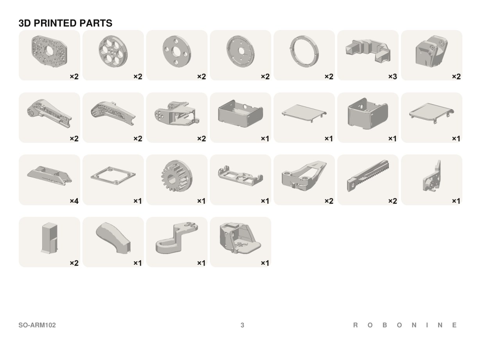

# Printing the parts

Every printed part of the SO-ARM 102 kit is in [`../models/stl/`](../models/stl/).
The editable CAD sources with the same names are in [`../models/step/`](../models/step/).

- `common/` holds the parts both arms use. Print the listed quantity once; it already covers two arms.
- `follower/` holds the parallel gripper, the camera mount and the follower board case.
- `leader/` holds the handle, trigger, wrist roll and the leader board case.

All parts fit a 180 × 180 mm bed. The largest part, the base, is 160 × 112.5 mm.

## Material

| Where | Material | Why |
|---|---|---|
| Arm links, base, servo holders | PET-CF, annealed if possible | Stiffest and most heat-resistant option tested near warm servos |
| Gripper clamps, covers, leader handle and trigger | PETG or PET-CF | Tougher against knocks |

The prototype was printed in **Fiberon PET-CF17**. In our filament tests, annealing cut PET-CF17
deflection after one hour at 65–70 °C from 3.4 mm to 0.3 mm. Annealing also makes the part more brittle,
so do not anneal parts that take impacts. Details:
[Choosing a filament for robotic arms](https://robonine.com/choosing-filament-for-robotic-arm-applications/).

The leader arm carries no load, so PLA should be enough for it. This has not been tested yet.

## 3MF slicer projects

The [3MF projects](../models/README.md#3mf-slicer-projects) include saved part orientations,
plate layouts and support settings. Open them as projects in **Bambu Studio**, select your
printer and filament, then slice and review the support preview.

| Project | Saved filament profile | Layer height | Walls | Top / bottom layers | Infill |
|---|---|---|:-:|:-:|---|
| [Leader](../models/3mf/SO102_leader.3mf) | Bambu PETG-CF | 0.20 mm | 3 | 5 / 4 | 15 % gyroid |
| [Follower arm](../models/3mf/SO102_follower.3mf) | Fiberon PET-CF17 | 0.20 mm | 6 | 6 / 6 | 30 % cubic |
| [Follower gripper and board case](../models/3mf/SO102_follower_gripper_box.3mf) | Bambu PETG-CF | 0.20 mm | 6 | 6 / 6 | 30 % cubic |

All three save a **Bambu Lab A1, 0.4 mm nozzle** profile on a **256 × 256 mm** bed.
Individual parts still fit a 180 × 180 mm bed, but the supplied layouts need to be split
across more plates for that size. Automatic tree supports are the global default;
some parts have support overrides, manual support settings or support blockers.

Print each project once for one complete kit, then print **one extra cable snap**:
the projects contain two in total, while the part list calls for three.

| Leader layout | Follower gripper and board case layout |
|:-:|:-:|
|  |  |

## Test-arm slicer settings

These are the settings the test arms were printed with. The supplied 3MF projects above
use different profiles; re-slice them to get filament and print-time estimates.

| Setting | Value |
|---|---|
| Walls | 4 |
| Top and bottom layers | 4 |
| Infill | 25 % gyroid |
| Supports | Yes, as needed |

For the gripper gear and gear racks use 100 % infill.

**More infill makes the follower stiffer.** With 100 % infill on all links and 35 % on the base,
the gripper deflection under 300 g dropped from 3.4 mm to 2.34 mm. The cost is filament and time:
about 720 g and 27 h instead of 500 g and 21 h, gripper not included.
For the leader, keep the infill low. It only has to be light and quick to print.

**Orientation matters.** Upper arms print best tilted, so the surface
comes out clean and the thin section does not crack. Lay long parts so the layer lines run
along the length of the part.

## Part list

Quantities are for one complete kit: one follower and one leader.

### Common parts, both arms

| Part number | Name | Qty |
|---|---|:-:|
| SO102.02.010 | Base | 2 |
| SO102.02.020 | Base ring | 2 |
| SO102.02.030 | Base washer | 2 |
| SO102.02.040 | Bottom top plate | 2 |
| SO102.02.050 | Bottom ring | 2 |
| SO102.02.060 | Bottom servo holder | 2 |
| SO102.02.070 | Bottom arm | 4 |
| SO102.02.080 | Upper arm left | 2 |
| SO102.02.080-01 | Upper arm right | 2 |
| SO102.02.090 | Wrist holder | 2 |
| SO102.02.130 | Cable snap | 3 |

### Follower only

| Part number | Name | Qty |
|---|---|:-:|
| RB9.01.062.011 | Main frame (D6.1) | 1 |
| RB9.01.062.024 | Clamp (D6.1) | 2 |
| RB9.01.062.030 | Gear rack | 2 |
| RB9.01.062.040 | Gear for gripper | 1 |
| RB9.01.062.100 | Nail | 2 |
| RB9.01.062.075 | Camera holder | 1 |
| RB9.01.062.090 | Camera spacer | 1 |
| SO102.02.100 | Board holder follower | 1 |
| SO102.02.100-01 | Board cap follower | 1 |

`(D6.1)` means the rod bores are sized for 6.1 mm. See the known issues in the main README if the gripper runs tight.

### Leader only

| Part number | Name | Qty |
|---|---|:-:|
| — | SO102 Handle | 1 |
| — | SO102 Trigger | 1 |
| — | SO102 Wrist roll | 1 |
| SO102.02.110 | Board holder leader | 1 |
| SO102.02.110-01 | Board cap leader | 1 |

## About the STL files

The STL files were exported from the STEP sources with a chord tolerance of 0.02 mm.
If you change a part, edit the STEP and export a new STL with the same name.
