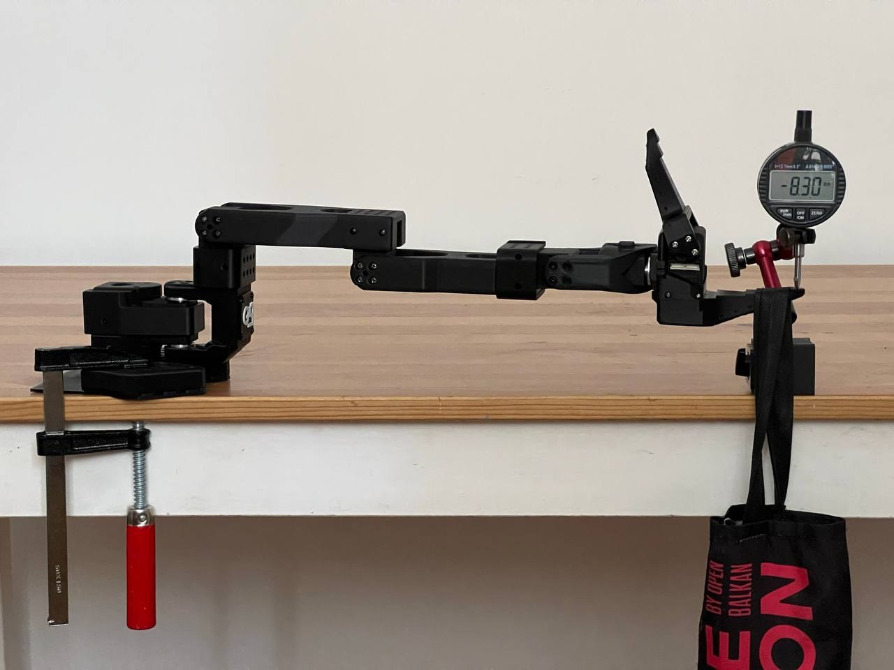
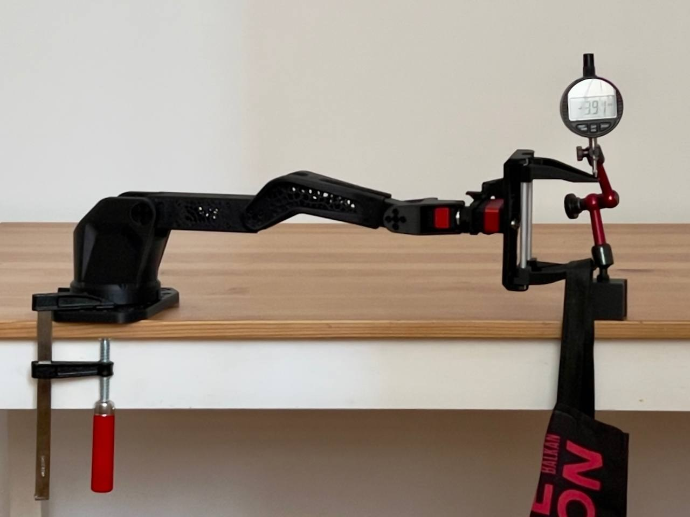

# Specifications and test results

Measured on Robonine prototypes in August and September 2026.
Numbers marked *calculated* come from the URDF model and servo datasheets, not from a measurement.

## Geometry

| Joint | Range |
|---|---|
| Base rotation | −176° … +176° (352°) |
| Shoulder lift | −43° … +181° (224°) |
| Elbow flex | −166° … +77° (243°) |
| Wrist flex | −85° … +111° (196°) |
| Wrist roll | −165° … +163° (328°) |
| Gripper | 0 … 85 mm |

| Link | Axis to axis |
|---|---|
| Base rotation to shoulder | 85 mm |
| Shoulder to elbow | 119 mm |
| Elbow to wrist flex | 139 mm |
| Wrist flex to wrist roll | 62 mm |
| Wrist roll to gripper tip | 132 mm |

| Reach, gripper tip centre | |
|---|---|
| Horizontal radius | 483 mm |
| Height above the base bottom | up to 544 mm |
| Below the base bottom, arm over a table edge | down to −301 mm |

Reach was computed from 100,000 random poses within the joint limits, with no self-collisions.

## Servos

| Joint | Follower | Leader |
|---|---|---|
| 1 Base rotation | STS3235 | STS3215 |
| 2 Shoulder lift | STS3250 | STS3215 |
| 3 Elbow flex | STS3250 | STS3215 |
| 4 Wrist flex | STS3235 | STS3215 |
| 5 Wrist roll | STS3215 1:345 | STS3215 |
| 6 Gripper / trigger | STS3215 | STS3215 |
| Supply | 12 V | 5 V |

## Gripper

| | |
|---|---|
| Type | Parallel, rack and pinion, two moving jaws |
| Span | 85 mm |
| Box, recommended maximum width | about 75 mm |
| Cylinder, recommended maximum diameter | about 70 mm |
| Sphere, recommended maximum diameter | about 60 mm |
| Camera | USB camera mounted on the gripper |

## Measured results against SO-ARM 101

| Metric | SO-ARM 101 | SO-ARM 102 | Change |
|---|---|---|---|
| Deflection at the gripper tip, 300 g, arm fully extended ¹ | 7.5 mm | 3.4 mm | −55 % |
| Same, all links at 100 % infill ¹ | — | 2.34 mm | −69 % |
| Horizontal radius | 441 mm | 483 mm | +9.5 % |
| Reach behind the base | 377 mm | 473 mm | +25.5 % |
| Base rotation range | 220° | 352° | +60 % |
| Elbow range | 194° | 243° | +25 % |
| Shoulder and elbow no-load speed, *calculated* | 270 °/s | 450 °/s | +67 % |
| Base joint backlash | 8.75 counts | 5.00 counts | −43 % |
| Horizontal tip error from base backlash, *calculated* | ±2.96 mm | ±1.85 mm | −37.5 % |
| Repeatability | — | about 0.1 mm | |
| Noise at 1 m | 70 dB | 60 dB | −10 dB |
| Rated payload | 250 g | 300 g | |

¹ Both arms were built with printed servo dummies in joints 2, 3 and 4, so only the frame is compared.
SO-ARM 101 printed in PLA, SO-ARM 102 in Fiberon PET-CF17 at 25 % infill.
A second run of the same SO-ARM 102 test gave 3.9 mm.

| SO-ARM 101 | SO-ARM 102 |
|:-:|:-:|
|  |  |

## Current and temperature, follower

Measured with a 300 g load on a repeating trajectory, ambient 30 °C, six STS3250 servos.

| | |
|---|---|
| Current, average | 1.26 A |
| Current, peak | 3.28 A |
| Servo temperature, maximum | 46 °C |

## Absolute accuracy

Still being tuned. With stock servo PID settings the tip sagged about 50 mm under the arm's own weight at full extension.
Tuned PID settings brought that down to about 5 mm. A dedicated accuracy profile is in progress.
